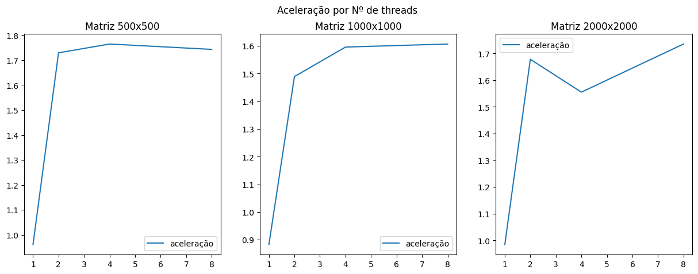

# Análise de Desempenho

Os gráficos foram gerados a partir dos dados no arquivo data/data.md, sendo que o valor considerado é a média dos 5 testes, aqui analisando apenas o tempo de Processamento, onde tivemos mudanças devido a escolha da maneira com que fizemos a multiplicação.

## Gráfico de Tempo de execução do Processamento por número de threads

Neste gráfico temos a linha laranja indicando o tempo de processamento gasto para executar o programa sequencial e a curva azul em função do aumento do número de threads.
Em todos os gráficos é possível perceber como a mudança para concorrência diminui consideravelmente o tempo de processamento, mas na terceira há um pico no caso das 4 threads, o que parece ter mais relação com outros programas do computador do que especificamente o código, na tabela de dados podemos ver que houve um aumento no tempo das 4 threads que não parece muito coerente visto que com 8 threads tivemos uma queda novamente.

## Gráfico de Tempo de execução do Processamento por número de threads

## Gráfico de Tempo de execução do Processamento por número de threads

Testando
